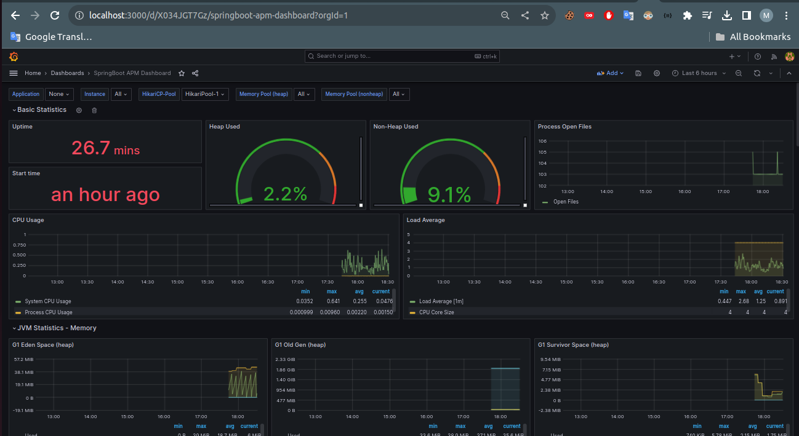

# Spring Boot Monitoring with Spring Boot Actuator, Prometheus and Grafana

## Spring Boot Actuator

Spring Boot Actuator is a sub-project of Spring Boot. It's used to monitor and manage spring boot application by providing metrics, health checks, and other useful endpoints.

### Installation
To add Spring Boot Actuator to our Spring Boot project, we should include the `spring-boot-starter-actuator` dependency in our `pom.xml`

#### Maven

```xml
<dependency>
	<groupId>org.springframework.boot</groupId>
	<artifactId>spring-boot-starter-actuator</artifactId>
</dependency>
```

*Note: Spring Boot Actuator is included automatically in Spring Boot starters, so no additional configuration is required.*

### Configuration

By default, all actuator endpoints are enabled. We can configure the actuator endpoints by adding the following properties to our `application.properties` file.

```properties
# Expose Actuator endpoints over the web, so they will be accessible via HTTP requests.
management.endpoints.web.exposure.include=* 

# Specifies the base path under which Actuator endpoints are exposed over the web.
management.endpoints.web.base-path=/admin

# Sets the health endpoint to always show health details when accessed.
management.endpoint.health.show-details=always

# Enables exposing environment and Java information through Actuator's info endpoint.
management.info.env.enabled=true
management.info.java.enabled=true

# Specifies app-related information to be exposed through Actuator's info endpoint.
info.app.name=MarketPlace Management Application
info.app.description=MarketPlace is a beginner-friendly Spring Boot application aimed to manage marketplace operations
info.app.version=1.0.0

```

### Actuator Endpoints

- **`/actuator/health`**: Shows application health information.
- **`/actuator/info`**: Displays application-related information.
- **`/actuator/metrics`**: Shows metrics information for the current application.
- **`/actuator/env`**: Exposes environment properties
- **`/actuator/loggers`**: Shows and modifies the configuration of loggers in the application.
- **`/actuator/httptrace`**: Displays HTTP trace information

### Usage

Now we can access the actuator endpoints by making HTTP requests to our application. For example, to access the info endpoint, we can make a GET request to `http://localhost:8080/admin/info`.

### Example: Actuator's health Endpoint


*Note: We can see above that the health endpoint shows the application is up and running.*

## Prometheus

Prometheus is an open-source monitoring and alerting system that is widely used for collecting and querying metrics from various systems. Integrating Prometheus with a Spring Boot application allows us to monitor and analyze application metrics such as HTTP requests, JVM memory usage, and custom application-specific metrics.

### Installation

To add Prometheus to our Spring Boot project, we should include the `micrometer-registry-prometheus` dependency in our `pom.xml`

#### Maven

```xml
<dependency>
	<groupId>io.micrometer</groupId>
	<artifactId>micrometer-registry-prometheus</artifactId>
	<version>1.12.3</version>
</dependency>
```

*Note: now if we run our application, we can access the Prometheus metrics at `http://localhost:8080/admin/prometheus`.*


*Note: We can see above the Prometheus metrics endpoint showing the metrics collected from our Spring Boot application.*

### Download Prometheus

- Visit the [Prometheus download page](https://prometheus.io/download/).
- Choose the appropriate version for our operating system and architecture.
- Extract the downloaded archive to a directory of our choice.


*Note: We can see above the Prometheus download page providing various options to download the Prometheus server.*

### Configuration

Inside the extracted folder we can find a `prometheus.yml` file. We should add the following configuration to scrape metrics from Spring Boot application.

```yaml
- job_name: 'spring-actuator'
    metrics_path: '/admin/prometheus'
    scrape_interval: 5s
    static_configs:
    - targets: ['localhost:8080']
```

### Usage

- We can run the Prometheus server by executing the `prometheus` executable from the installation directory.
- Let's open a web browser and navigate to `http://localhost:9090` *Note: Prometheus will start scraping metrics from the configured targets and storing them in its database.*
- Now we can access Prometheus web interface to explore collected metrics, execute queries, and create custom dashboards.

### Prometheus User Interface


*Note: We can see above that the Prometheus web interface allows us to explore collected metrics and execute queries.*

## Grafana

Grafana is an open-source data visualization and monitoring tool used to create customizable dashboards and graphs for analyzing and monitoring data from various sources such as **Prometheus**.

### Installation

1. **Download Grafana**:
	- Visit the [Grafana download page](https://grafana.com/grafana/download).


*Note: We can see above the Grafana download page providing various options to download the Grafana server.*

2. **Install Grafana**:
	- Follow the installation instructions for the chosen operating system.

3. **Start Grafana**:
	- Start the Grafana server by executing the `grafana-server` executable from the installation directory.
	*In linux, we can start the Grafana server by running the following command: `sudo systemctl start grafana-server`.*

### Configuration

1. **Access Grafana UI**:
	- Open a web browser and navigate to `http://localhost:3000`.


*Note: We can see above the Grafana login page, where we can log in using the default credentials.*

2. **Log in to Grafana**:
	- Log in to Grafana using the default credentials (username: `admin`, password: `admin`).
	- Change the default password and create a new user account.

3. **Add Prometheus Data Source**:
	- Click on the `Connections` in the menu.
	- Click on `Data sources`.
	- Click on `Add new data source`.
	- Choose `Prometheus` as the data source type.
	- Set the URL to `http://localhost:9090`.
	- Click on `Save & Test` to save the data source configuration.

### Usage

We can create custom dashboards or use existing ones available in the Grafana dashboard library.

1. **Importing Dashboards**: Grafana provides a library of pre-built dashboards that we can import and use. [Grafana dashboard library](https://grafana.com/grafana/dashboards) to explore available dashboards.


*Note: We can see above the Grafana dashboard library providing various dashboards that we can import and use.*

2. **Using Existing Dashboards**
   - First we should download the JSON file of the desired dashboard from the Grafana dashboard library.
   - In Grafana, let's navigate to "Dashboards" > "New" > "Import" and upload the JSON file.
   - Aftre that we have to configure the data source for the dashboard, in our case it's Prometheus.
   - Now we can customize the dashboard as needed.

### Example: Spring Boot APM Dashboard

The Spring Boot APM Dashboard provides insights into the performance and health of Spring Boot applications.



# Conclusion

This comprehensive README provides guidance on setting up monitoring and visualization tools for our Spring Boot applications, including Spring Boot Actuator, Prometheus, and Grafana.

By following the steps outlined in this README, we did setup a comprehensive monitoring and visualization solution for our Spring Boot application, enabling us to monitor, analyze, and optimize it's performance and health effectively.
